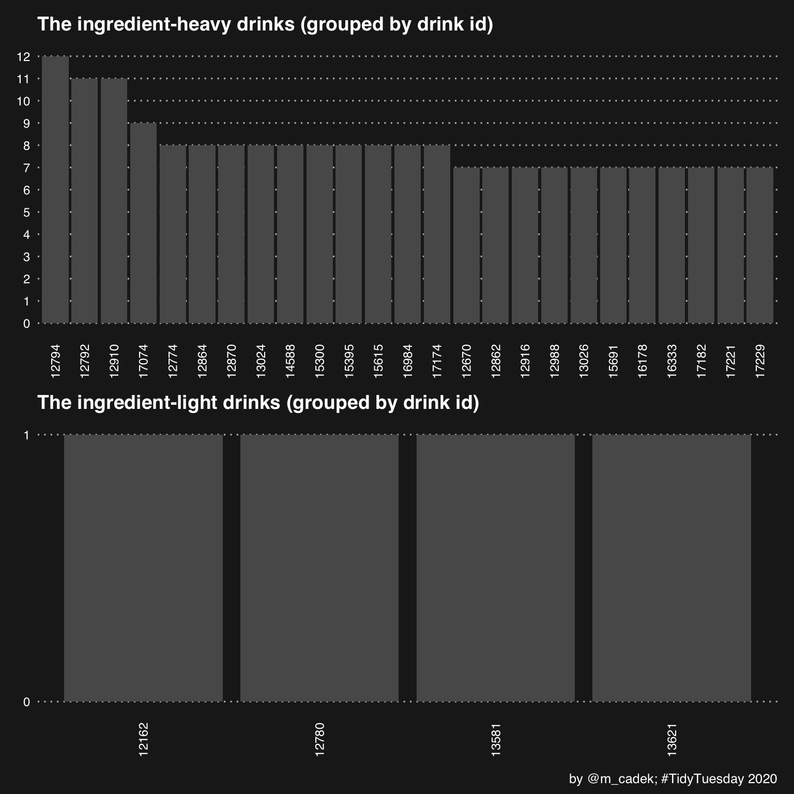
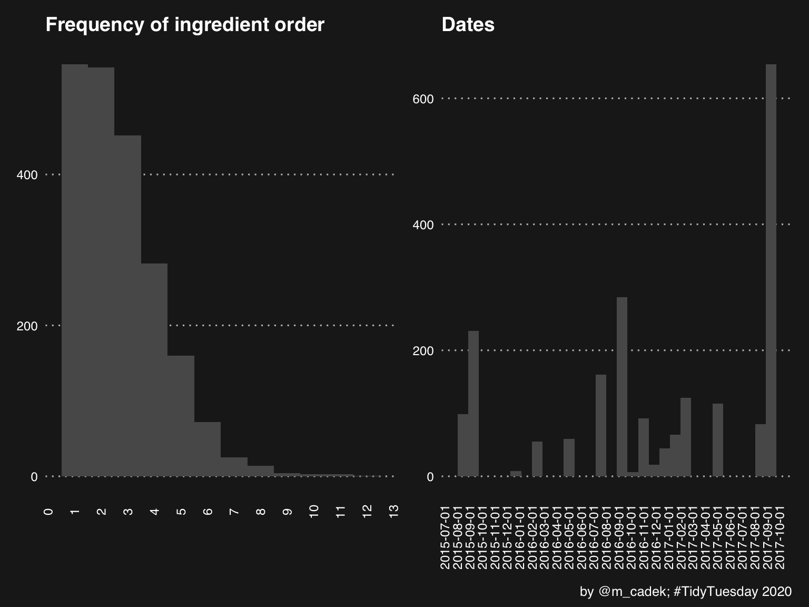
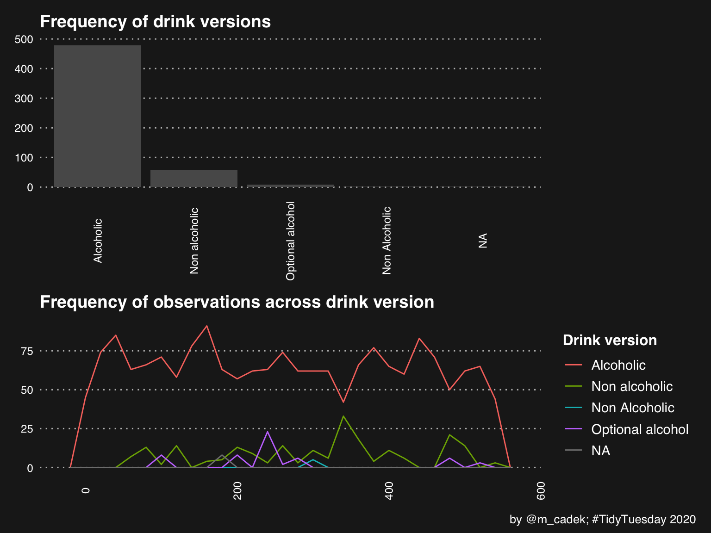
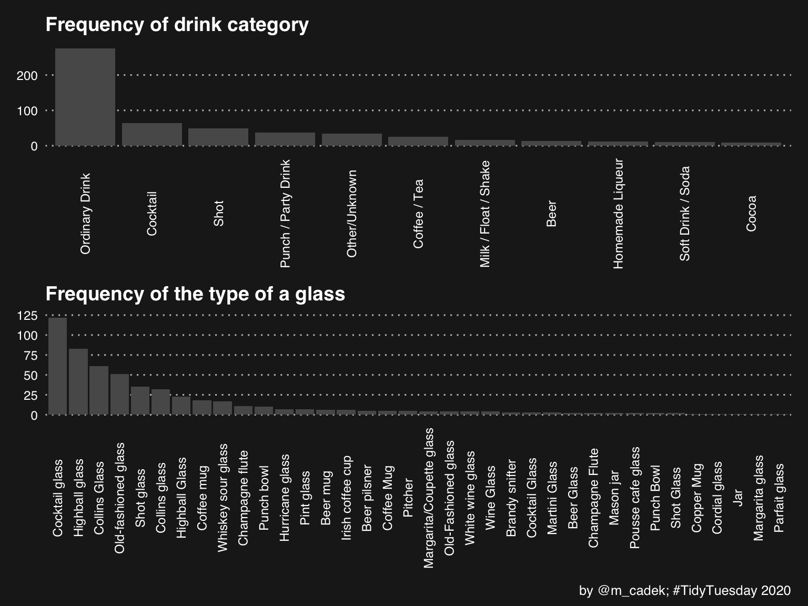

<link href="_raw_files/libs/tabwid-1.1.3/tabwid.css" rel="stylesheet" />
<script src="_raw_files/libs/tabwid-1.1.3/tabwid.js"></script>


## Background story about carrots and parsnips

Some time ago, I wanted to use machine learning so I have learned to use the [caret](https://topepo.github.io/caret/) developed by Max Kuhn. Caret was my choice (and for some problems I would use it again) because it offers pretty much every ML algorithm I can think of - it is very comprehensive. It also makes it possible to use these algorithms a unified and consistent way. This was also the first time I realised how useful it is to have a common framework or package "universe".

However, there are some downsides when you wish to use caret:

-   First, the package relies on a lot of dependencies, and to install and set-up them in a reproducible environment can be a pain. I think the author did not initially expect the package to become so comprehensive.

-   Second, if your machine or internet connection is not the fastest then it is going to take a while.

-   Third, some packages simply remain quirky and difficult to use in caret interference, and lastly, speed - caret is not the fastest package.

There are more niche things which depend on your domain use, but I think these are the key downside I see. They make the use of the package somewhat inconvenient at the time but nothing you cannot resolve if you still want to use it. That said, I was very excited when I have learned that [parsnip](https://parsnip.tidymodels.org/) - a package similar to caret was developed. Like caret, parsnip promises [consistency](https://www.tidyverse.org/blog/2018/11/parsnip-0-0-1/) across various modelling packages in R. Parsnip does this faster and in a more unified interference (universe) of packages called [Tidymodels](https://www.tidymodels.org/).

## What is this post about?

The post is about two things. First, It's been some time since I have attempted [Tidy Tuesday](https://github.com/rfordatascience/tidytuesday) and it's also been on my to-do list to familiarise myself with the Tidymodels and a little bit of parsnip.

The post is two parts. In the first, I will utilise Tidy Tuesday dataset and show an example of basic exploratory data analysis (EDA). I will be doing some data manipulation and coercion using Tidyverse and preparing the data for the second part. I will also develop (I will call it) a research question for this dataset.

In the second part, I will take the data and show a basic example of clustering using the Tidymodels framework.

I think this post may illustrate how a question or objective of analysis through EDA is developed and some basic features of the aforementioned packages (plus hopefully some clustering).

If you don't want to follow me alongside in this post and just want to download the scripts for R, please use this [repository](https://github.com/martincadek/tidytuesdays/tree/master/2020_05_26_tt_22) on GitHub and open the `script.R` file. The second part is accessible via this - [link to the part II](https://www.martincadek.com/posts/tidy-analysis-cocktails-part-ii/).

Feel free to reuse any of the parts with appropriate attribution.

## Cocktails data from Tidy Tuesday 22 (2020)

The dataset I am using here is available from Tidy Tuesday 22 (26/05/2020) and describes various cocktails and their content. I was inspired by the idea of clustering various cocktails published on [Five Thirty Eight](https://fivethirtyeight.com/videos/we-got-drunk-on-margaritas-for-science/) and though this would be the perfect opportunity to play with the Tidymodels. They have utilised k-means clustering algorithm to assess what are the four main types of margaritas.

## Used packages

Below are the packages I am going to use throughout this project (both part I and II).

     [1] "tidyverse"    "tidymodels"   "here"         "colorspace"   "janitor"     
     [6] "showtext"     "patchwork"    "ggthemes"     "lubridate"    "flextable"   
    [11] "tidytext"     "arrow"        "klaR"         "tidytuesdayR" "ggimage"     
    [16] "rsvg"         "conflicted"   "viridis"      "flextable"    "ggrepel"     

Below is a slice from the `SessionInfo()` output so you can see if you are running similar setup. I am trying to use the latest available packages as of the June 2020. The source files are provided in the following [repository](https://github.com/martincadek/tidytuesdays/tree/master/2020_05_26_tt_22).

## Load data

I have already downloaded and saved the data (as `.rds`). Two files are available for the Tidy Tuesday 22 - I will focus on datafile `cocktails.csv` as it should be more analysis-ready. The other file, `boston_cocktails.csv` is not used here because it is messier and would require more cleaning.

``` r
tt_cocktails <- tidytuesdayR::tt_load(x = "2020-05-26")
data <- tt_cocktails$cocktails
cocktails <- tt_cocktails$cocktails
data <- data %>%
  select(-c(iba, video)) # drop iba and video columns with lot of NAs
```

## Opening data

After opening the data, I want to quickly see what I am tackling here. At this stage, I have only a vague idea about the data. I simply want to familiarise myself with it - understand the variables, missing values, potential errors (whether systematic or unique).

    Rows: 2,104
    Columns: 13
    $ row_id            <dbl> 0, 0, 1, 1, 1, 1, 1, 1, 1, 1, 2, 2, 3, 3, 3, 3, 3, 3…
    $ drink             <chr> "'57 Chevy with a White License Plate", "'57 Chevy w…
    $ date_modified     <dttm> 2016-07-18 22:49:04, 2016-07-18 22:49:04, 2016-07-1…
    $ id_drink          <dbl> 14029, 14029, 15395, 15395, 15395, 15395, 15395, 153…
    $ alcoholic         <chr> "Alcoholic", "Alcoholic", "Alcoholic", "Alcoholic", …
    $ category          <chr> "Cocktail", "Cocktail", "Shot", "Shot", "Shot", "Sho…
    $ drink_thumb       <chr> "http://www.thecocktaildb.com/images/media/drink/qyy…
    $ glass             <chr> "Highball glass", "Highball glass", "Old-fashioned g…
    $ iba               <chr> NA, NA, NA, NA, NA, NA, NA, NA, NA, NA, NA, NA, NA, …
    $ video             <lgl> NA, NA, NA, NA, NA, NA, NA, NA, NA, NA, NA, NA, NA, …
    $ ingredient_number <dbl> 1, 2, 1, 2, 3, 4, 5, 6, 7, 8, 1, 2, 1, 2, 3, 4, 5, 6…
    $ ingredient        <chr> "Creme de Cacao", "Vodka", "Absolut Kurant", "Grand …
    $ measure           <chr> "1 oz white", "1 oz", "1/2 oz", "1/4 oz", "1/4 oz", …

There are 2104 rows and 13 columns (or 2104 observations and 13 variables) before any further coercion. I am now going to look at the types of variables in dataset. The code below displays several variable types in the cocktails the dataset. There are is one date (POSIxct + POSIXt), three numeric or integer variables, the rest is categorical or character. However; a closer look reveals these data are mostly categorical and some further cleaning is needed. For example, the `measure` contains unit value and volume. EDA should give me better ideas about the questions I want to ask here.

    unlist.sapply.cocktails..class..
    character   logical   numeric   POSIXct    POSIXt 
            8         1         3         1         1 

## Exploratory data analysis (EDA)

With every dataset, I want to make sure I understand what the variables represent. First, what are the observations? In this case, each observation represents an ingredient which belongs to a cocktail. This can be further understood when looking at the "raw" source of data [here](https://www.kaggle.com/ai-first/cocktail-ingredients).

In the previous overview, I saw 13 variables. I will quickly interpret each. The `row_id`, `drink_id`, and `drink` are in theory the same things represented differently - they are the drink. The `date_modified` is likely a date when the entry was made to the database. The `alcoholic` refers to a version of a drink, i.e. alcoholic or non-alcoholic. The `category` refers to the type of drink (e.g.: shot). The `drink_thumb` is an image associated with a drink. The `glass` refers to the serving glass of drink. I will not bother much with `iba` and `video`, as shown later, they are mostly missing but the first stands for "International Bartenders association category" while the latter for "Video to how to make". The `ingredient_number` refers to the order of ingredients in a drink. The `ingredient` is what a drink consists of, and finally, the `measure` is in what quantity an ingredient exists in a drink.

**Word of caution.** What I find a little tricky with datasets like this (but it is a very common feature of datasets, not an error). Except for `ingredient`, `ingredient_number`, and `measure`, the other variables can be grouped. To be precise, there is no point counting `glass`, `alcoholic`, and `category` without grouping all variables by `drink_id`. The resulting number without grouping would be the count of all of 2104 rows containing "alcohol" when there are only 546 drinks! If I were precise the variables I have mentioned should be called, for example, `drink_glass` and variables like `measure`, for example, `ingredient_measure` to differ which relate to what. This will become clearer as I progress with the EDA and analysis.

At this stage, I can see that most variables are in what is called "nominal" scale of measurement. This can be changed with further aggregations across `drink_id`, `row_id`, and `drink` (and I will need to do this). That way I will be able to get, for example, how many drinks containing gin are there and a "new" variables in "ratio" scale.

The `ingredient_number` and `date_modified` are the only variables not in the nominal scale of measurement. The `ingredient_number` tells me the maximum number of ingredients possible, i.e. 12 and minimum, i.e. 1 and in sense of measurement is in "ordinal" scale. It also makes me think of another aspect of the data - the complexity. The more combinations of ingredients, the more complex it is. This starts to probe into questioning the dataset. For example, how complex are the drinks? I quite fancy gin, are there some complex ones? How do they differ from the simple ones? Now, the `date_modified` is in something called an `interval` scale of measurement but I am not going to make use of this variable.

Lastly, the `measure` surely contains some information about quantity. It does but needs to be cleaned further. For example, "1 oz white" should be "1" and then "oz" (the white is shown in ingredient). That way I can get some sense of quantity to compare and get the variable from "nominal" to "interval" or possibly "ratio" scale if I standardise the values.

I will now look at the missing variables.

<div class="tabwid"><style>.cl-7dba37e4{}.cl-7db6f5ca{font-family:'Helvetica';font-size:11pt;font-weight:bold;font-style:normal;text-decoration:none;color:rgba(0, 0, 0, 1.00);background-color:transparent;}.cl-7db6f5de{font-family:'Helvetica';font-size:11pt;font-weight:normal;font-style:normal;text-decoration:none;color:rgba(0, 0, 0, 1.00);background-color:transparent;}.cl-7db85bd6{margin:0;text-align:right;border-bottom: 0 solid rgba(0, 0, 0, 1.00);border-top: 0 solid rgba(0, 0, 0, 1.00);border-left: 0 solid rgba(0, 0, 0, 1.00);border-right: 0 solid rgba(0, 0, 0, 1.00);padding-bottom:5pt;padding-top:5pt;padding-left:5pt;padding-right:5pt;line-height: 1;background-color:transparent;}.cl-7db86928{width:0.75in;background-color:rgba(207, 207, 207, 1.00);vertical-align: middle;border-bottom: 0 solid rgba(0, 0, 0, 1.00);border-top: 0 solid rgba(0, 0, 0, 1.00);border-left: 0 solid rgba(0, 0, 0, 1.00);border-right: 0 solid rgba(0, 0, 0, 1.00);margin-bottom:0;margin-top:0;margin-left:0;margin-right:0;}.cl-7db86929{width:0.75in;background-color:rgba(239, 239, 239, 1.00);vertical-align: middle;border-bottom: 0 solid rgba(0, 0, 0, 1.00);border-top: 0 solid rgba(0, 0, 0, 1.00);border-left: 0 solid rgba(0, 0, 0, 1.00);border-right: 0 solid rgba(0, 0, 0, 1.00);margin-bottom:0;margin-top:0;margin-left:0;margin-right:0;}</style><table data-quarto-disable-processing='true' class='cl-7dba37e4'><thead><tr style="overflow-wrap:break-word;"><th class="cl-7db86928"><p class="cl-7db85bd6"><span class="cl-7db6f5ca">row_id</span></p></th><th class="cl-7db86928"><p class="cl-7db85bd6"><span class="cl-7db6f5ca">drink</span></p></th><th class="cl-7db86928"><p class="cl-7db85bd6"><span class="cl-7db6f5ca">date_modified</span></p></th><th class="cl-7db86928"><p class="cl-7db85bd6"><span class="cl-7db6f5ca">id_drink</span></p></th><th class="cl-7db86928"><p class="cl-7db85bd6"><span class="cl-7db6f5ca">alcoholic</span></p></th><th class="cl-7db86928"><p class="cl-7db85bd6"><span class="cl-7db6f5ca">category</span></p></th><th class="cl-7db86928"><p class="cl-7db85bd6"><span class="cl-7db6f5ca">drink_thumb</span></p></th><th class="cl-7db86928"><p class="cl-7db85bd6"><span class="cl-7db6f5ca">glass</span></p></th><th class="cl-7db86928"><p class="cl-7db85bd6"><span class="cl-7db6f5ca">iba</span></p></th><th class="cl-7db86928"><p class="cl-7db85bd6"><span class="cl-7db6f5ca">video</span></p></th><th class="cl-7db86928"><p class="cl-7db85bd6"><span class="cl-7db6f5ca">ingredient_number</span></p></th><th class="cl-7db86928"><p class="cl-7db85bd6"><span class="cl-7db6f5ca">ingredient</span></p></th><th class="cl-7db86928"><p class="cl-7db85bd6"><span class="cl-7db6f5ca">measure</span></p></th></tr></thead><tbody><tr style="overflow-wrap:break-word;"><td class="cl-7db86929"><p class="cl-7db85bd6"><span class="cl-7db6f5de">0</span></p></td><td class="cl-7db86929"><p class="cl-7db85bd6"><span class="cl-7db6f5de">0</span></p></td><td class="cl-7db86929"><p class="cl-7db85bd6"><span class="cl-7db6f5de">3</span></p></td><td class="cl-7db86929"><p class="cl-7db85bd6"><span class="cl-7db6f5de">0</span></p></td><td class="cl-7db86929"><p class="cl-7db85bd6"><span class="cl-7db6f5de">8</span></p></td><td class="cl-7db86929"><p class="cl-7db85bd6"><span class="cl-7db6f5de">0</span></p></td><td class="cl-7db86929"><p class="cl-7db85bd6"><span class="cl-7db6f5de">0</span></p></td><td class="cl-7db86929"><p class="cl-7db85bd6"><span class="cl-7db6f5de">0</span></p></td><td class="cl-7db86929"><p class="cl-7db85bd6"><span class="cl-7db6f5de">1,848</span></p></td><td class="cl-7db86929"><p class="cl-7db85bd6"><span class="cl-7db6f5de">2,104</span></p></td><td class="cl-7db86929"><p class="cl-7db85bd6"><span class="cl-7db6f5de">0</span></p></td><td class="cl-7db86929"><p class="cl-7db85bd6"><span class="cl-7db6f5de">0</span></p></td><td class="cl-7db86929"><p class="cl-7db85bd6"><span class="cl-7db6f5de">0</span></p></td></tr></tbody></table></div>

The variables `date_modified`, and `alcoholic` contain a small number of NA. The variables `iba` and `video` are almost entirely made out of NAs. I believe it is safe to remove `iba`, `video`. I don't think I can guess or do anything with date but filling the alcoholic should be straightforward if I can see the content of drink based on the ingredients.

Now, I want to run EDA on cocktails dataset. I will first summarise and visualise anything numerical and date, then I will move to strings and logical variables. I am also going to save each type as following temporary data frames ("t\_") and count the number of cocktails and their ingredients.

``` r
t_categorical <- data %>% 
     select_if(list(Negate(is.numeric))) %>% 
     select(-date_modified) %>%
     mutate_all(as.factor)

t_numerical <- data %>% 
     select_if(Negate(is.character))

ingr_per_cocktail <- t_numerical %>% select(id_drink) %>% group_by(id_drink) %>% count() %>% pull(n)
```

### Numerical

The `summary()` function from `base` R package is sufficient to show the numerical data

         row_id    date_modified                    id_drink     ingredient_number
     Min.   :  0   Min.   :2015-08-13 10:12:27   Min.   :11000   Min.   : 1.00    
     1st Qu.:135   1st Qu.:2016-07-18 22:28:43   1st Qu.:11984   1st Qu.: 1.00    
     Median :264   Median :2017-01-02 20:18:16   Median :12944   Median : 2.00    
     Mean   :268   Mean   :2016-12-02 04:27:17   Mean   :13715   Mean   : 2.73    
     3rd Qu.:399   3rd Qu.:2017-09-02 16:40:11   3rd Qu.:15615   3rd Qu.: 4.00    
     Max.   :545   Max.   :2017-09-08 18:07:16   Max.   :17230   Max.   :12.00    
                   NA's   :3                                                      

To reiterate, none of the variables classed as numeric are numeric in sense of ratio scale. The `row_id` and `drink_id` are simply more convenient names for the cocktails.

I can also see that the actual number of drinks in the dataset is (n = 546) as per the `row_id`. Therefore, there are 546 unique cocktails. I will not visualise the id variables because the graphs would not provide any more information than what I have just described. However, I would like to see the other variables, so I will use a series of histograms and bar plots to visualise the data.





The graphs above show various features of ingredients, ingredients order, and date. I can make several observations.

The first two panels show the drinks grouped by the number of ingredients. The top panel shows the most ingredient "heavy" drinks (i.e., they have 7 or more ingredients), and then the second panel shows the most ingredient "light" drinks (i.e., drinks with only a single ingredient). There are only 4 drinks with a single ingredient. These are followed by 90 drinks with two ingredients. There is also only 1 drink with 12 ingredients, followed by 2 drinks with up to 11 ingredients and cut-off at 11 with 7 ingredients.

This observation leads nicely to the graph at the bottom left, it is not surprising to see that the order of ingredients is heavily skewed - in other words, it shows that each cocktail has at least 1 ingredient, few have more than 8, and only one has 12 ingredients. The common number of ingredients in a drink is 4 if I use median, and 3.85 if mean is used.

Finally, the bottom right graph shows dates - most of the observations are "newer", they have been made between August and October 2017. I could look at when these observations are stored (e.g., hours) but I do not think that is very useful.

The information provided thus far makes me convinced that my questions should make use of the grouped dataset, ingredient's order, and ingredients themselves. Time to move onto the categorical variables.

### Categorical

Again, the summary function in R can show what categorical variables am I dealing with and which are possible to visualise (e.g., they do not have a large number of levels or "Other" values). For example, `drink`, `drink_thumb` (picture), `ingredient`, and `measure` have large number of levels and would not make a good bar chart because of this.

                  drink                 alcoholic                   category   
     Angelica Liqueur:  12   Alcoholic       :1821   Ordinary Drink     :1060  
     Amaretto Liqueur:  11   Non alcoholic   : 214   Cocktail           : 244  
     Egg Nog #4      :  11   Non Alcoholic   :   5   Punch / Party Drink: 187  
     Arizona Twister :   9   Optional alcohol:  56   Shot               : 152  
     (Other)         :2061   NA's            :   8   (Other)            : 461  
                                                                   drink_thumb  
     http://www.thecocktaildb.com/images/media/drink/yuurps1472667672.jpg:  12  
     http://www.thecocktaildb.com/images/media/drink/swqxuv1472719649.jpg:  11  
     http://www.thecocktaildb.com/images/media/drink/wpspsy1468875747.jpg:  11  
     http://www.thecocktaildb.com/images/media/drink/ido1j01493068134.jpg:   9  
     (Other)                                                             :2061  
                     glass            ingredient      measure    
     Cocktail glass     :435   Vodka       :  88   1 oz   : 189  
     Highball glass     :302   Gin         :  84   1/2 oz : 141  
     Collins Glass      :269   Sugar       :  70   \n     : 123  
     Old-fashioned glass:213   Orange juice:  57   2 oz   : 107  
     (Other)            :885   (Other)     :1805   (Other):1544  

From the summary, I can see that there several categories which could be useful for further analyses and filtering. For example, I am thinking that the analysis could focus only on "alcoholic drinks" to ensure more consistency. I can also see the `drink` names which occur most often and have the most ingredients, e.g. Angelica Liqueur is quite complex (that is the 12 ingredient one) and looking at some sort of drink complexity could be useful. I also see that vodka appears to be the most common ingredient which is followed by gin, and sugar. Additionally, the measure seems to include some funky levels, such as "n" which is not a measure but a new paragraph line and leftover from scraping that should be removed.

At this point, I am thinking that there are simply too many ingredients to focus on them all. Therefore, narrowing the dataset could provide better insight. For example, I like gin so I could focus on drinks containing gin, this also makes only alcoholic drinks the viable option.

Some variables could variables be difficult to visualise because of the number of their levels. I will supplement this by using three simple descriptive tables on variables that had too many levels to visualise, i.e. `ingredient`, and `measure.` I will not show drink as that would essentially lead to showing the ingredient heavy and ingredient light drinks again (from the previous output). I will do the tabular summaries and then the visualisations of categorical variables.

<div class="tabwid"><style>.cl-7e08236e{}.cl-7e057178{font-family:'Helvetica';font-size:11pt;font-weight:bold;font-style:normal;text-decoration:none;color:rgba(0, 0, 0, 1.00);background-color:transparent;}.cl-7e057179{font-family:'Helvetica';font-size:11pt;font-weight:normal;font-style:normal;text-decoration:none;color:rgba(0, 0, 0, 1.00);background-color:transparent;}.cl-7e06901c{margin:0;text-align:left;border-bottom: 0 solid rgba(0, 0, 0, 1.00);border-top: 0 solid rgba(0, 0, 0, 1.00);border-left: 0 solid rgba(0, 0, 0, 1.00);border-right: 0 solid rgba(0, 0, 0, 1.00);padding-bottom:5pt;padding-top:5pt;padding-left:5pt;padding-right:5pt;line-height: 1;background-color:transparent;}.cl-7e069026{margin:0;text-align:right;border-bottom: 0 solid rgba(0, 0, 0, 1.00);border-top: 0 solid rgba(0, 0, 0, 1.00);border-left: 0 solid rgba(0, 0, 0, 1.00);border-right: 0 solid rgba(0, 0, 0, 1.00);padding-bottom:5pt;padding-top:5pt;padding-left:5pt;padding-right:5pt;line-height: 1;background-color:transparent;}.cl-7e069c6a{width:3in;background-color:rgba(207, 207, 207, 1.00);vertical-align: middle;border-bottom: 0 solid rgba(0, 0, 0, 1.00);border-top: 0 solid rgba(0, 0, 0, 1.00);border-left: 0 solid rgba(0, 0, 0, 1.00);border-right: 0 solid rgba(0, 0, 0, 1.00);margin-bottom:0;margin-top:0;margin-left:0;margin-right:0;}.cl-7e069c74{width:3in;background-color:rgba(207, 207, 207, 1.00);vertical-align: middle;border-bottom: 0 solid rgba(0, 0, 0, 1.00);border-top: 0 solid rgba(0, 0, 0, 1.00);border-left: 0 solid rgba(0, 0, 0, 1.00);border-right: 0 solid rgba(0, 0, 0, 1.00);margin-bottom:0;margin-top:0;margin-left:0;margin-right:0;}.cl-7e069c75{width:3in;background-color:rgba(239, 239, 239, 1.00);vertical-align: middle;border-bottom: 0 solid rgba(0, 0, 0, 1.00);border-top: 0 solid rgba(0, 0, 0, 1.00);border-left: 0 solid rgba(0, 0, 0, 1.00);border-right: 0 solid rgba(0, 0, 0, 1.00);margin-bottom:0;margin-top:0;margin-left:0;margin-right:0;}.cl-7e069c7e{width:3in;background-color:rgba(239, 239, 239, 1.00);vertical-align: middle;border-bottom: 0 solid rgba(0, 0, 0, 1.00);border-top: 0 solid rgba(0, 0, 0, 1.00);border-left: 0 solid rgba(0, 0, 0, 1.00);border-right: 0 solid rgba(0, 0, 0, 1.00);margin-bottom:0;margin-top:0;margin-left:0;margin-right:0;}</style><table data-quarto-disable-processing='true' class='cl-7e08236e'><thead><tr style="overflow-wrap:break-word;"><th class="cl-7e069c6a"><p class="cl-7e06901c"><span class="cl-7e057178">The most frequent ingredients</span></p></th><th class="cl-7e069c74"><p class="cl-7e069026"><span class="cl-7e057178">Frequency</span></p></th></tr></thead><tbody><tr style="overflow-wrap:break-word;"><td class="cl-7e069c75"><p class="cl-7e06901c"><span class="cl-7e057179">Vodka</span></p></td><td class="cl-7e069c7e"><p class="cl-7e069026"><span class="cl-7e057179">88</span></p></td></tr><tr style="overflow-wrap:break-word;"><td class="cl-7e069c75"><p class="cl-7e06901c"><span class="cl-7e057179">Gin</span></p></td><td class="cl-7e069c7e"><p class="cl-7e069026"><span class="cl-7e057179">84</span></p></td></tr><tr style="overflow-wrap:break-word;"><td class="cl-7e069c75"><p class="cl-7e06901c"><span class="cl-7e057179">Sugar</span></p></td><td class="cl-7e069c7e"><p class="cl-7e069026"><span class="cl-7e057179">70</span></p></td></tr><tr style="overflow-wrap:break-word;"><td class="cl-7e069c75"><p class="cl-7e06901c"><span class="cl-7e057179">Orange juice</span></p></td><td class="cl-7e069c7e"><p class="cl-7e069026"><span class="cl-7e057179">57</span></p></td></tr><tr style="overflow-wrap:break-word;"><td class="cl-7e069c75"><p class="cl-7e06901c"><span class="cl-7e057179">Lemon juice</span></p></td><td class="cl-7e069c7e"><p class="cl-7e069026"><span class="cl-7e057179">51</span></p></td></tr><tr style="overflow-wrap:break-word;"><td class="cl-7e069c75"><p class="cl-7e06901c"><span class="cl-7e057179">Lemon</span></p></td><td class="cl-7e069c7e"><p class="cl-7e069026"><span class="cl-7e057179">49</span></p></td></tr><tr style="overflow-wrap:break-word;"><td class="cl-7e069c75"><p class="cl-7e06901c"><span class="cl-7e057179">Light rum</span></p></td><td class="cl-7e069c7e"><p class="cl-7e069026"><span class="cl-7e057179">43</span></p></td></tr><tr style="overflow-wrap:break-word;"><td class="cl-7e069c75"><p class="cl-7e06901c"><span class="cl-7e057179">Ice</span></p></td><td class="cl-7e069c7e"><p class="cl-7e069026"><span class="cl-7e057179">41</span></p></td></tr><tr style="overflow-wrap:break-word;"><td class="cl-7e069c75"><p class="cl-7e06901c"><span class="cl-7e057179">Amaretto</span></p></td><td class="cl-7e069c7e"><p class="cl-7e069026"><span class="cl-7e057179">39</span></p></td></tr><tr style="overflow-wrap:break-word;"><td class="cl-7e069c75"><p class="cl-7e06901c"><span class="cl-7e057179">Water</span></p></td><td class="cl-7e069c7e"><p class="cl-7e069026"><span class="cl-7e057179">38</span></p></td></tr></tbody></table></div>

The table above provides a good idea about the most common/frequent ingredients. Vodka, gin, and sugar lead the way by far. I have limited the table to the top 10 ingredients to avoid large summaries and it is not informative to look at all the different ingredients because I am more curious what could be the common ingredients to further narrow my analysis at.

The second table shows the most frequent measures of the various ingredients.

<div class="tabwid"><style>.cl-7e113e18{}.cl-7e0e7fe8{font-family:'Helvetica';font-size:11pt;font-weight:bold;font-style:normal;text-decoration:none;color:rgba(0, 0, 0, 1.00);background-color:transparent;}.cl-7e0e8038{font-family:'Helvetica';font-size:11pt;font-weight:normal;font-style:normal;text-decoration:none;color:rgba(0, 0, 0, 1.00);background-color:transparent;}.cl-7e0f98b0{margin:0;text-align:left;border-bottom: 0 solid rgba(0, 0, 0, 1.00);border-top: 0 solid rgba(0, 0, 0, 1.00);border-left: 0 solid rgba(0, 0, 0, 1.00);border-right: 0 solid rgba(0, 0, 0, 1.00);padding-bottom:5pt;padding-top:5pt;padding-left:5pt;padding-right:5pt;line-height: 1;background-color:transparent;}.cl-7e0f98ba{margin:0;text-align:right;border-bottom: 0 solid rgba(0, 0, 0, 1.00);border-top: 0 solid rgba(0, 0, 0, 1.00);border-left: 0 solid rgba(0, 0, 0, 1.00);border-right: 0 solid rgba(0, 0, 0, 1.00);padding-bottom:5pt;padding-top:5pt;padding-left:5pt;padding-right:5pt;line-height: 1;background-color:transparent;}.cl-7e0fa706{width:3in;background-color:rgba(207, 207, 207, 1.00);vertical-align: middle;border-bottom: 0 solid rgba(0, 0, 0, 1.00);border-top: 0 solid rgba(0, 0, 0, 1.00);border-left: 0 solid rgba(0, 0, 0, 1.00);border-right: 0 solid rgba(0, 0, 0, 1.00);margin-bottom:0;margin-top:0;margin-left:0;margin-right:0;}.cl-7e0fa710{width:3in;background-color:rgba(207, 207, 207, 1.00);vertical-align: middle;border-bottom: 0 solid rgba(0, 0, 0, 1.00);border-top: 0 solid rgba(0, 0, 0, 1.00);border-left: 0 solid rgba(0, 0, 0, 1.00);border-right: 0 solid rgba(0, 0, 0, 1.00);margin-bottom:0;margin-top:0;margin-left:0;margin-right:0;}.cl-7e0fa711{width:3in;background-color:rgba(239, 239, 239, 1.00);vertical-align: middle;border-bottom: 0 solid rgba(0, 0, 0, 1.00);border-top: 0 solid rgba(0, 0, 0, 1.00);border-left: 0 solid rgba(0, 0, 0, 1.00);border-right: 0 solid rgba(0, 0, 0, 1.00);margin-bottom:0;margin-top:0;margin-left:0;margin-right:0;}.cl-7e0fa71a{width:3in;background-color:rgba(239, 239, 239, 1.00);vertical-align: middle;border-bottom: 0 solid rgba(0, 0, 0, 1.00);border-top: 0 solid rgba(0, 0, 0, 1.00);border-left: 0 solid rgba(0, 0, 0, 1.00);border-right: 0 solid rgba(0, 0, 0, 1.00);margin-bottom:0;margin-top:0;margin-left:0;margin-right:0;}</style><table data-quarto-disable-processing='true' class='cl-7e113e18'><thead><tr style="overflow-wrap:break-word;"><th class="cl-7e0fa706"><p class="cl-7e0f98b0"><span class="cl-7e0e7fe8">The frequent measures</span></p></th><th class="cl-7e0fa710"><p class="cl-7e0f98ba"><span class="cl-7e0e7fe8">Frequency</span></p></th></tr></thead><tbody><tr style="overflow-wrap:break-word;"><td class="cl-7e0fa711"><p class="cl-7e0f98b0"><span class="cl-7e0e8038">1 oz</span></p></td><td class="cl-7e0fa71a"><p class="cl-7e0f98ba"><span class="cl-7e0e8038">189</span></p></td></tr><tr style="overflow-wrap:break-word;"><td class="cl-7e0fa711"><p class="cl-7e0f98b0"><span class="cl-7e0e8038">1/2 oz</span></p></td><td class="cl-7e0fa71a"><p class="cl-7e0f98ba"><span class="cl-7e0e8038">141</span></p></td></tr><tr style="overflow-wrap:break-word;"><td class="cl-7e0fa711"><p class="cl-7e0f98b0"><br></p></td><td class="cl-7e0fa71a"><p class="cl-7e0f98ba"><span class="cl-7e0e8038">123</span></p></td></tr><tr style="overflow-wrap:break-word;"><td class="cl-7e0fa711"><p class="cl-7e0f98b0"><span class="cl-7e0e8038">2 oz</span></p></td><td class="cl-7e0fa71a"><p class="cl-7e0f98ba"><span class="cl-7e0e8038">107</span></p></td></tr><tr style="overflow-wrap:break-word;"><td class="cl-7e0fa711"><p class="cl-7e0f98b0"><span class="cl-7e0e8038">1 1/2 oz</span></p></td><td class="cl-7e0fa71a"><p class="cl-7e0f98ba"><span class="cl-7e0e8038">97</span></p></td></tr><tr style="overflow-wrap:break-word;"><td class="cl-7e0fa711"><p class="cl-7e0f98b0"><span class="cl-7e0e8038">1</span></p></td><td class="cl-7e0fa71a"><p class="cl-7e0f98ba"><span class="cl-7e0e8038">91</span></p></td></tr><tr style="overflow-wrap:break-word;"><td class="cl-7e0fa711"><p class="cl-7e0f98b0"><span class="cl-7e0e8038">1 tsp</span></p></td><td class="cl-7e0fa71a"><p class="cl-7e0f98ba"><span class="cl-7e0e8038">57</span></p></td></tr><tr style="overflow-wrap:break-word;"><td class="cl-7e0fa711"><p class="cl-7e0f98b0"><span class="cl-7e0e8038">1 part</span></p></td><td class="cl-7e0fa71a"><p class="cl-7e0f98ba"><span class="cl-7e0e8038">50</span></p></td></tr><tr style="overflow-wrap:break-word;"><td class="cl-7e0fa711"><p class="cl-7e0f98b0"><span class="cl-7e0e8038">1 shot</span></p></td><td class="cl-7e0fa71a"><p class="cl-7e0f98ba"><span class="cl-7e0e8038">48</span></p></td></tr><tr style="overflow-wrap:break-word;"><td class="cl-7e0fa711"><p class="cl-7e0f98b0"><span class="cl-7e0e8038">3/4 oz</span></p></td><td class="cl-7e0fa71a"><p class="cl-7e0f98ba"><span class="cl-7e0e8038">47</span></p></td></tr></tbody></table></div>

First, note the "empty" row. This is, in fact, the `/newspace` I have mentioned already - this needs to be removed. The most common measure seems to be "1 oz", then "1/2", and "2", "oz" seems to be also the typical unit of measure. It is clear that the `measure` is a mix of volume and unit and will need to be further cleaned using functions such as `str_split` or `separate`. I will try to do this using regular expressions.

The variables which are "safe" to visualise are `alcoholic`, `category`, and `glass` as they do not have a large number of levels and should be safe to plot. I will need to group these by `drink` name because otherwise, I would run into the issue I have warned about earlier.

I will start with the `alcoholic` variable.





The final pair of bar plots should be straightforward to interpret, the plots show the most common levels for each variable. Notably, drinks served in cocktail glass, and drinks categorised as ordinary are the most common.

### Summary

*What did I learn about the data?* The exploratory analysis revealed that there is 546 of cocktails with average 3.85 ingredients in each. The most common type of drink is alcoholic, and most likely the drinks are served in cocktail glass. There are cocktails such as Angelica Liqueur which seem to be awfully complex and four drinks which are essentially one ingredient. I also need to be careful and appropriately group by drink names or ids to ensure I am not creating nonsensical summaries or values. There are also some issues requiring coercion, namely, the `measure` variable needs to be cleaned further, it also contains some missing values (likely due to the web scraping).

*What questions can I ask?* The analysis should narrow down the scope. I've decided to further explore complexity of the drinks and its ingredients. To do that, I need to focus on one ingredient as the main with the other ingredients as "complementary". I am curious to see more about gin drinks, so questions I am asking here are - What drinks contain gin? What are the simple, or complex gin drinks? What are the other ingredients defining gin drinks? What other features and qualities such drinks have?

These and related questions will be explored in the following post. To go and read the post, please follow this [link to the part II](https://www.martincadek.com/posts/tidy-analysis-cocktails-part-ii/).

### Reproducibility disclaimer

Please note that this is an older post. While I can guarantee that the code below will work at time the post was published, R packages are updated regularly and it is possible that the code will not work in the future. Please see below the R.version to see the last time the code was checked. Future post will improve on this.

                   _                           
    platform       aarch64-apple-darwin20      
    arch           aarch64                     
    os             darwin20                    
    system         aarch64, darwin20           
    status                                     
    major          4                           
    minor          5.0                         
    year           2025                        
    month          04                          
    day            11                          
    svn rev        88135                       
    language       R                           
    version.string R version 4.5.0 (2025-04-11)
    nickname       How About a Twenty-Six      
