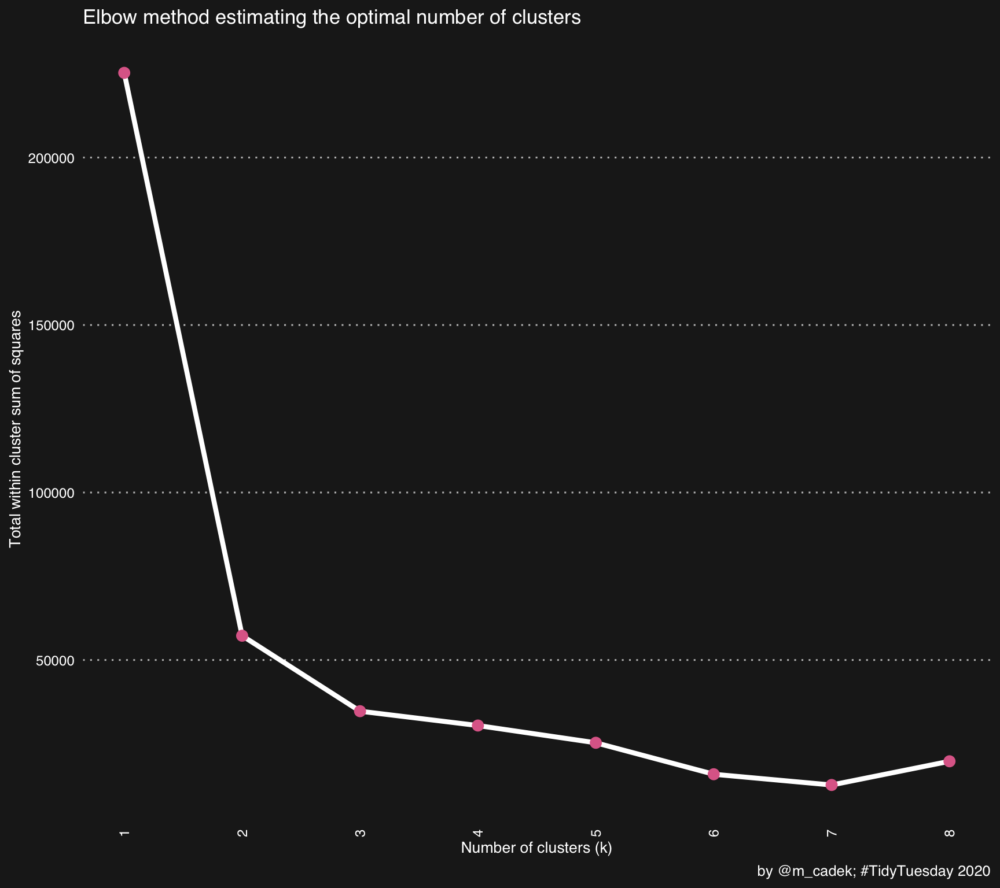

<link href="_raw_files/libs/tabwid-1.1.3/tabwid.css" rel="stylesheet" />
<script src="_raw_files/libs/tabwid-1.1.3/tabwid.js"></script>


## Background

This is the second part of the two-part post. The first part is accessible via this - [link to the part I](https://www.martincadek.com/posts/tidy-analysis-of-cocktails-part-i/). Please read the first part for the background information or the relevant [Tidytuesday](https://github.com/rfordatascience/tidytuesday/tree/master/data/2020/2020-05-26) repository. If you just want to download the scripts for R, please use this [repository](https://github.com/martincadek/tidytuesdays/tree/master/2020_05_26_tt_22) on GitHub and open the `script.R` file.

## What is the blog post about?

In the second part, I am going to prepare the data for analysis and show an example of exploratory clustering using the Tidymodels framework. The analysis is inspired by [Five Thirty Eight](https://fivethirtyeight.com/videos/we-got-drunk-on-margaritas-for-science/) and tidymodels [tutorial](https://www.tidymodels.org/learn/statistics/k-means/) which is great reading if you want to get into this method.

This part will be less wordy and feature more visualisations. While I will also show some of the code in this part, I deliberately wanted to avoid this and I rather encourage you to download the full script - especially if you want to see some of the coercion, and the ggplot2 code behind the graphs.

Feel free to reuse any of the parts with appropriate attribution.

## Used packages

These packages were used throughout both part I and part II of the projects. Please see the previous [link to the part I](https://www.martincadek.com/posts/tidy-analysis-of-cocktails-part-i/) for further comments on reproducibility.

                 [,1] [,2] [,3] [,4]
    tidyverse       2    0    0    2
    tidymodels      1    3    0    1
    here            1    0    1    1
    colorspace      2    1    1    2
    janitor         2    2    1    2
    showtext        0    9    7    0
    patchwork       1    3    0    1
    ggthemes        5    1    0    5
    lubridate       1    9    4    1
    flextable       0    9    9    0
    tidytext        0    4    2    0
    arrow          20    0    0    2
    klaR            1    7    3    1
    tidytuesdayR    1    2    1    1
    ggimage         0    3    3    0
    rsvg            2    6    2    2
    conflicted      1    2    0    1
    viridis         0    6    5    0
    flextable       0    9    9    0
    ggrepel         0    9    6    0

## Used data

For a reminder, I am working with the following dataset. This is the version of the dataset before further cleaning and tidying.

<div class="tabwid"><style>.cl-9864b8ba{}.cl-98616bba{font-family:'Helvetica';font-size:11pt;font-weight:bold;font-style:normal;text-decoration:none;color:rgba(0, 0, 0, 1.00);background-color:transparent;}.cl-98616bc4{font-family:'Helvetica';font-size:11pt;font-weight:normal;font-style:normal;text-decoration:none;color:rgba(0, 0, 0, 1.00);background-color:transparent;}.cl-9862c690{margin:0;text-align:right;border-bottom: 0 solid rgba(0, 0, 0, 1.00);border-top: 0 solid rgba(0, 0, 0, 1.00);border-left: 0 solid rgba(0, 0, 0, 1.00);border-right: 0 solid rgba(0, 0, 0, 1.00);padding-bottom:5pt;padding-top:5pt;padding-left:5pt;padding-right:5pt;line-height: 1;background-color:transparent;}.cl-9862c691{margin:0;text-align:left;border-bottom: 0 solid rgba(0, 0, 0, 1.00);border-top: 0 solid rgba(0, 0, 0, 1.00);border-left: 0 solid rgba(0, 0, 0, 1.00);border-right: 0 solid rgba(0, 0, 0, 1.00);padding-bottom:5pt;padding-top:5pt;padding-left:5pt;padding-right:5pt;line-height: 1;background-color:transparent;}.cl-9862d5c2{width:0.75in;background-color:rgba(207, 207, 207, 1.00);vertical-align: middle;border-bottom: 0 solid rgba(0, 0, 0, 1.00);border-top: 0 solid rgba(0, 0, 0, 1.00);border-left: 0 solid rgba(0, 0, 0, 1.00);border-right: 0 solid rgba(0, 0, 0, 1.00);margin-bottom:0;margin-top:0;margin-left:0;margin-right:0;}.cl-9862d5c3{width:0.75in;background-color:rgba(207, 207, 207, 1.00);vertical-align: middle;border-bottom: 0 solid rgba(0, 0, 0, 1.00);border-top: 0 solid rgba(0, 0, 0, 1.00);border-left: 0 solid rgba(0, 0, 0, 1.00);border-right: 0 solid rgba(0, 0, 0, 1.00);margin-bottom:0;margin-top:0;margin-left:0;margin-right:0;}.cl-9862d5c4{width:0.75in;background-color:rgba(239, 239, 239, 1.00);vertical-align: middle;border-bottom: 0 solid rgba(0, 0, 0, 1.00);border-top: 0 solid rgba(0, 0, 0, 1.00);border-left: 0 solid rgba(0, 0, 0, 1.00);border-right: 0 solid rgba(0, 0, 0, 1.00);margin-bottom:0;margin-top:0;margin-left:0;margin-right:0;}.cl-9862d5cc{width:0.75in;background-color:rgba(239, 239, 239, 1.00);vertical-align: middle;border-bottom: 0 solid rgba(0, 0, 0, 1.00);border-top: 0 solid rgba(0, 0, 0, 1.00);border-left: 0 solid rgba(0, 0, 0, 1.00);border-right: 0 solid rgba(0, 0, 0, 1.00);margin-bottom:0;margin-top:0;margin-left:0;margin-right:0;}</style><table data-quarto-disable-processing='true' class='cl-9864b8ba'><thead><tr style="overflow-wrap:break-word;"><th class="cl-9862d5c2"><p class="cl-9862c690"><span class="cl-98616bba">row_id</span></p></th><th class="cl-9862d5c3"><p class="cl-9862c691"><span class="cl-98616bba">drink</span></p></th><th class="cl-9862d5c2"><p class="cl-9862c690"><span class="cl-98616bba">date_modified</span></p></th><th class="cl-9862d5c2"><p class="cl-9862c690"><span class="cl-98616bba">id_drink</span></p></th><th class="cl-9862d5c3"><p class="cl-9862c691"><span class="cl-98616bba">alcoholic</span></p></th><th class="cl-9862d5c3"><p class="cl-9862c691"><span class="cl-98616bba">category</span></p></th><th class="cl-9862d5c3"><p class="cl-9862c691"><span class="cl-98616bba">drink_thumb</span></p></th><th class="cl-9862d5c3"><p class="cl-9862c691"><span class="cl-98616bba">glass</span></p></th><th class="cl-9862d5c2"><p class="cl-9862c690"><span class="cl-98616bba">ingredient_number</span></p></th><th class="cl-9862d5c3"><p class="cl-9862c691"><span class="cl-98616bba">ingredient</span></p></th><th class="cl-9862d5c3"><p class="cl-9862c691"><span class="cl-98616bba">measure</span></p></th></tr></thead><tbody><tr style="overflow-wrap:break-word;"><td class="cl-9862d5c4"><p class="cl-9862c690"><span class="cl-98616bc4">0</span></p></td><td class="cl-9862d5cc"><p class="cl-9862c691"><span class="cl-98616bc4">'57 Chevy with a White License Plate</span></p></td><td class="cl-9862d5c4"><p class="cl-9862c690"><span class="cl-98616bc4">2016-07-18 22:49:04</span></p></td><td class="cl-9862d5c4"><p class="cl-9862c690"><span class="cl-98616bc4">14,029</span></p></td><td class="cl-9862d5cc"><p class="cl-9862c691"><span class="cl-98616bc4">Alcoholic</span></p></td><td class="cl-9862d5cc"><p class="cl-9862c691"><span class="cl-98616bc4">Cocktail</span></p></td><td class="cl-9862d5cc"><p class="cl-9862c691"><span class="cl-98616bc4">http://www.thecocktaildb.com/images/media/drink/qyyvtu1468878544.jpg</span></p></td><td class="cl-9862d5cc"><p class="cl-9862c691"><span class="cl-98616bc4">Highball glass</span></p></td><td class="cl-9862d5c4"><p class="cl-9862c690"><span class="cl-98616bc4">1</span></p></td><td class="cl-9862d5cc"><p class="cl-9862c691"><span class="cl-98616bc4">Creme de Cacao</span></p></td><td class="cl-9862d5cc"><p class="cl-9862c691"><span class="cl-98616bc4">1 oz white</span></p></td></tr><tr style="overflow-wrap:break-word;"><td class="cl-9862d5c4"><p class="cl-9862c690"><span class="cl-98616bc4">0</span></p></td><td class="cl-9862d5cc"><p class="cl-9862c691"><span class="cl-98616bc4">'57 Chevy with a White License Plate</span></p></td><td class="cl-9862d5c4"><p class="cl-9862c690"><span class="cl-98616bc4">2016-07-18 22:49:04</span></p></td><td class="cl-9862d5c4"><p class="cl-9862c690"><span class="cl-98616bc4">14,029</span></p></td><td class="cl-9862d5cc"><p class="cl-9862c691"><span class="cl-98616bc4">Alcoholic</span></p></td><td class="cl-9862d5cc"><p class="cl-9862c691"><span class="cl-98616bc4">Cocktail</span></p></td><td class="cl-9862d5cc"><p class="cl-9862c691"><span class="cl-98616bc4">http://www.thecocktaildb.com/images/media/drink/qyyvtu1468878544.jpg</span></p></td><td class="cl-9862d5cc"><p class="cl-9862c691"><span class="cl-98616bc4">Highball glass</span></p></td><td class="cl-9862d5c4"><p class="cl-9862c690"><span class="cl-98616bc4">2</span></p></td><td class="cl-9862d5cc"><p class="cl-9862c691"><span class="cl-98616bc4">Vodka</span></p></td><td class="cl-9862d5cc"><p class="cl-9862c691"><span class="cl-98616bc4">1 oz</span></p></td></tr><tr style="overflow-wrap:break-word;"><td class="cl-9862d5c4"><p class="cl-9862c690"><span class="cl-98616bc4">1</span></p></td><td class="cl-9862d5cc"><p class="cl-9862c691"><span class="cl-98616bc4">1-900-FUK-MEUP</span></p></td><td class="cl-9862d5c4"><p class="cl-9862c690"><span class="cl-98616bc4">2016-07-18 22:27:04</span></p></td><td class="cl-9862d5c4"><p class="cl-9862c690"><span class="cl-98616bc4">15,395</span></p></td><td class="cl-9862d5cc"><p class="cl-9862c691"><span class="cl-98616bc4">Alcoholic</span></p></td><td class="cl-9862d5cc"><p class="cl-9862c691"><span class="cl-98616bc4">Shot</span></p></td><td class="cl-9862d5cc"><p class="cl-9862c691"><span class="cl-98616bc4">http://www.thecocktaildb.com/images/media/drink/uxywyw1468877224.jpg</span></p></td><td class="cl-9862d5cc"><p class="cl-9862c691"><span class="cl-98616bc4">Old-fashioned glass</span></p></td><td class="cl-9862d5c4"><p class="cl-9862c690"><span class="cl-98616bc4">1</span></p></td><td class="cl-9862d5cc"><p class="cl-9862c691"><span class="cl-98616bc4">Absolut Kurant</span></p></td><td class="cl-9862d5cc"><p class="cl-9862c691"><span class="cl-98616bc4">1/2 oz</span></p></td></tr><tr style="overflow-wrap:break-word;"><td class="cl-9862d5c4"><p class="cl-9862c690"><span class="cl-98616bc4">1</span></p></td><td class="cl-9862d5cc"><p class="cl-9862c691"><span class="cl-98616bc4">1-900-FUK-MEUP</span></p></td><td class="cl-9862d5c4"><p class="cl-9862c690"><span class="cl-98616bc4">2016-07-18 22:27:04</span></p></td><td class="cl-9862d5c4"><p class="cl-9862c690"><span class="cl-98616bc4">15,395</span></p></td><td class="cl-9862d5cc"><p class="cl-9862c691"><span class="cl-98616bc4">Alcoholic</span></p></td><td class="cl-9862d5cc"><p class="cl-9862c691"><span class="cl-98616bc4">Shot</span></p></td><td class="cl-9862d5cc"><p class="cl-9862c691"><span class="cl-98616bc4">http://www.thecocktaildb.com/images/media/drink/uxywyw1468877224.jpg</span></p></td><td class="cl-9862d5cc"><p class="cl-9862c691"><span class="cl-98616bc4">Old-fashioned glass</span></p></td><td class="cl-9862d5c4"><p class="cl-9862c690"><span class="cl-98616bc4">2</span></p></td><td class="cl-9862d5cc"><p class="cl-9862c691"><span class="cl-98616bc4">Grand Marnier</span></p></td><td class="cl-9862d5cc"><p class="cl-9862c691"><span class="cl-98616bc4">1/4 oz</span></p></td></tr><tr style="overflow-wrap:break-word;"><td class="cl-9862d5c4"><p class="cl-9862c690"><span class="cl-98616bc4">1</span></p></td><td class="cl-9862d5cc"><p class="cl-9862c691"><span class="cl-98616bc4">1-900-FUK-MEUP</span></p></td><td class="cl-9862d5c4"><p class="cl-9862c690"><span class="cl-98616bc4">2016-07-18 22:27:04</span></p></td><td class="cl-9862d5c4"><p class="cl-9862c690"><span class="cl-98616bc4">15,395</span></p></td><td class="cl-9862d5cc"><p class="cl-9862c691"><span class="cl-98616bc4">Alcoholic</span></p></td><td class="cl-9862d5cc"><p class="cl-9862c691"><span class="cl-98616bc4">Shot</span></p></td><td class="cl-9862d5cc"><p class="cl-9862c691"><span class="cl-98616bc4">http://www.thecocktaildb.com/images/media/drink/uxywyw1468877224.jpg</span></p></td><td class="cl-9862d5cc"><p class="cl-9862c691"><span class="cl-98616bc4">Old-fashioned glass</span></p></td><td class="cl-9862d5c4"><p class="cl-9862c690"><span class="cl-98616bc4">3</span></p></td><td class="cl-9862d5cc"><p class="cl-9862c691"><span class="cl-98616bc4">Chambord raspberry liqueur</span></p></td><td class="cl-9862d5cc"><p class="cl-9862c691"><span class="cl-98616bc4">1/4 oz</span></p></td></tr><tr style="overflow-wrap:break-word;"><td class="cl-9862d5c4"><p class="cl-9862c690"><span class="cl-98616bc4">1</span></p></td><td class="cl-9862d5cc"><p class="cl-9862c691"><span class="cl-98616bc4">1-900-FUK-MEUP</span></p></td><td class="cl-9862d5c4"><p class="cl-9862c690"><span class="cl-98616bc4">2016-07-18 22:27:04</span></p></td><td class="cl-9862d5c4"><p class="cl-9862c690"><span class="cl-98616bc4">15,395</span></p></td><td class="cl-9862d5cc"><p class="cl-9862c691"><span class="cl-98616bc4">Alcoholic</span></p></td><td class="cl-9862d5cc"><p class="cl-9862c691"><span class="cl-98616bc4">Shot</span></p></td><td class="cl-9862d5cc"><p class="cl-9862c691"><span class="cl-98616bc4">http://www.thecocktaildb.com/images/media/drink/uxywyw1468877224.jpg</span></p></td><td class="cl-9862d5cc"><p class="cl-9862c691"><span class="cl-98616bc4">Old-fashioned glass</span></p></td><td class="cl-9862d5c4"><p class="cl-9862c690"><span class="cl-98616bc4">4</span></p></td><td class="cl-9862d5cc"><p class="cl-9862c691"><span class="cl-98616bc4">Midori melon liqueur</span></p></td><td class="cl-9862d5cc"><p class="cl-9862c691"><span class="cl-98616bc4">1/4 oz</span></p></td></tr></tbody></table></div>

## Choosing the algorithm

The method applied in here is called [k-means (p.460)](https://web.stanford.edu/~hastie/ElemStatLearn/). This method relies on numerical variables (as it requires the computation of Euclidean distance matrix) and although it is possible to transform categorical or ordinal variables (via dummy coding / one-hot encoding), such approach is [discouraged](https://www.ibm.com/support/pages/node/418861). That said, there are some alternatives, for example, see this [discussion](https://datascience.stackexchange.com/questions/22/k-means-clustering-for-mixed-numeric-and-categorical-data) or [this](https://towardsdatascience.com/clustering-on-mixed-type-data-8bbd0a2569c3) and [this](https://arxiv.org/pdf/1304.6478.pdf).

I used k-means as it is a simple ML algorithm, and at least with my setup, it is relatively resource-light. The algorithms such as K-modes or Gower distance are a suitable alternative when the assumptions fit, but I found them slow (*I wonder if other folks have better experience optimising these techniques on high-dimensional categorical data?*).

## Tidying & data manipulation

The tidying I've done is discussed briefly. It is included in the full script at the following [GitHub repository](https://github.com/martincadek/tidytuesdays/tree/master/2020_05_26_tt_22) - `script.R`. While the data was relatively clean to begin with, I still needed to engineer it and prepare it for the clustering analysis via the k-means method.

Here is the summary of what I did:

-   Trimmed and cleaned all character variables

-   Extracted numerical quantity from the measure volume

-   Converted quantity from the measure column to millilitres (where it was sensible)

-   Standardised character vectors and their letter case

-   Standardised the date variable

-   Removed any missing or corrupt rows

-   Removed drink the image column

-   Created variables with collapsed factor levels for a number of variables

Once tidied, the data looked like this (some columns were removed due to space):

<div class="tabwid"><style>.cl-9870efa4{}.cl-986d3ce2{font-family:'Helvetica';font-size:11pt;font-weight:bold;font-style:normal;text-decoration:none;color:rgba(0, 0, 0, 1.00);background-color:transparent;}.cl-986d3cec{font-family:'Helvetica';font-size:11pt;font-weight:normal;font-style:normal;text-decoration:none;color:rgba(0, 0, 0, 1.00);background-color:transparent;}.cl-986e7594{margin:0;text-align:right;border-bottom: 0 solid rgba(0, 0, 0, 1.00);border-top: 0 solid rgba(0, 0, 0, 1.00);border-left: 0 solid rgba(0, 0, 0, 1.00);border-right: 0 solid rgba(0, 0, 0, 1.00);padding-bottom:5pt;padding-top:5pt;padding-left:5pt;padding-right:5pt;line-height: 1;background-color:transparent;}.cl-986e759e{margin:0;text-align:left;border-bottom: 0 solid rgba(0, 0, 0, 1.00);border-top: 0 solid rgba(0, 0, 0, 1.00);border-left: 0 solid rgba(0, 0, 0, 1.00);border-right: 0 solid rgba(0, 0, 0, 1.00);padding-bottom:5pt;padding-top:5pt;padding-left:5pt;padding-right:5pt;line-height: 1;background-color:transparent;}.cl-986e80ca{width:0.75in;background-color:rgba(207, 207, 207, 1.00);vertical-align: middle;border-bottom: 0 solid rgba(0, 0, 0, 1.00);border-top: 0 solid rgba(0, 0, 0, 1.00);border-left: 0 solid rgba(0, 0, 0, 1.00);border-right: 0 solid rgba(0, 0, 0, 1.00);margin-bottom:0;margin-top:0;margin-left:0;margin-right:0;}.cl-986e80d4{width:0.75in;background-color:rgba(207, 207, 207, 1.00);vertical-align: middle;border-bottom: 0 solid rgba(0, 0, 0, 1.00);border-top: 0 solid rgba(0, 0, 0, 1.00);border-left: 0 solid rgba(0, 0, 0, 1.00);border-right: 0 solid rgba(0, 0, 0, 1.00);margin-bottom:0;margin-top:0;margin-left:0;margin-right:0;}.cl-986e80d5{width:0.75in;background-color:rgba(239, 239, 239, 1.00);vertical-align: middle;border-bottom: 0 solid rgba(0, 0, 0, 1.00);border-top: 0 solid rgba(0, 0, 0, 1.00);border-left: 0 solid rgba(0, 0, 0, 1.00);border-right: 0 solid rgba(0, 0, 0, 1.00);margin-bottom:0;margin-top:0;margin-left:0;margin-right:0;}.cl-986e80de{width:0.75in;background-color:rgba(239, 239, 239, 1.00);vertical-align: middle;border-bottom: 0 solid rgba(0, 0, 0, 1.00);border-top: 0 solid rgba(0, 0, 0, 1.00);border-left: 0 solid rgba(0, 0, 0, 1.00);border-right: 0 solid rgba(0, 0, 0, 1.00);margin-bottom:0;margin-top:0;margin-left:0;margin-right:0;}</style><table data-quarto-disable-processing='true' class='cl-9870efa4'><thead><tr style="overflow-wrap:break-word;"><th class="cl-986e80ca"><p class="cl-986e7594"><span class="cl-986d3ce2">row_id</span></p></th><th class="cl-986e80d4"><p class="cl-986e759e"><span class="cl-986d3ce2">drink</span></p></th><th class="cl-986e80ca"><p class="cl-986e7594"><span class="cl-986d3ce2">date_modified</span></p></th><th class="cl-986e80ca"><p class="cl-986e7594"><span class="cl-986d3ce2">id_drink</span></p></th><th class="cl-986e80d4"><p class="cl-986e759e"><span class="cl-986d3ce2">alcoholic</span></p></th><th class="cl-986e80d4"><p class="cl-986e759e"><span class="cl-986d3ce2">category</span></p></th><th class="cl-986e80d4"><p class="cl-986e759e"><span class="cl-986d3ce2">glass</span></p></th><th class="cl-986e80d4"><p class="cl-986e759e"><span class="cl-986d3ce2">ingredient</span></p></th><th class="cl-986e80d4"><p class="cl-986e759e"><span class="cl-986d3ce2">measure_vol_dsh</span></p></th><th class="cl-986e80d4"><p class="cl-986e759e"><span class="cl-986d3ce2">measure_unit</span></p></th><th class="cl-986e80ca"><p class="cl-986e7594"><span class="cl-986d3ce2">measure_new</span></p></th><th class="cl-986e80ca"><p class="cl-986e7594"><span class="cl-986d3ce2">measure_ml</span></p></th><th class="cl-986e80ca"><p class="cl-986e7594"><span class="cl-986d3ce2">measure_stdz</span></p></th><th class="cl-986e80d4"><p class="cl-986e759e"><span class="cl-986d3ce2">ingredient_and_others</span></p></th></tr></thead><tbody><tr style="overflow-wrap:break-word;"><td class="cl-986e80d5"><p class="cl-986e7594"><span class="cl-986d3cec">0</span></p></td><td class="cl-986e80de"><p class="cl-986e759e"><span class="cl-986d3cec">'57 Chevy with a White License Plate</span></p></td><td class="cl-986e80d5"><p class="cl-986e7594"><span class="cl-986d3cec">2016-07-18 22:49:04</span></p></td><td class="cl-986e80d5"><p class="cl-986e7594"><span class="cl-986d3cec">14,029</span></p></td><td class="cl-986e80de"><p class="cl-986e759e"><span class="cl-986d3cec">alcoholic</span></p></td><td class="cl-986e80de"><p class="cl-986e759e"><span class="cl-986d3cec">cocktail</span></p></td><td class="cl-986e80de"><p class="cl-986e759e"><span class="cl-986d3cec">highball glass</span></p></td><td class="cl-986e80de"><p class="cl-986e759e"><span class="cl-986d3cec">creme de cacao</span></p></td><td class="cl-986e80de"><p class="cl-986e759e"><span class="cl-986d3cec"></span></p></td><td class="cl-986e80de"><p class="cl-986e759e"><span class="cl-986d3cec">oz white</span></p></td><td class="cl-986e80d5"><p class="cl-986e7594"><span class="cl-986d3cec">1.00</span></p></td><td class="cl-986e80d5"><p class="cl-986e7594"><span class="cl-986d3cec">28</span></p></td><td class="cl-986e80d5"><p class="cl-986e7594"><span class="cl-986d3cec">-0.073</span></p></td><td class="cl-986e80de"><p class="cl-986e759e"><span class="cl-986d3cec">uncommon ingredient</span></p></td></tr><tr style="overflow-wrap:break-word;"><td class="cl-986e80d5"><p class="cl-986e7594"><span class="cl-986d3cec">0</span></p></td><td class="cl-986e80de"><p class="cl-986e759e"><span class="cl-986d3cec">'57 Chevy with a White License Plate</span></p></td><td class="cl-986e80d5"><p class="cl-986e7594"><span class="cl-986d3cec">2016-07-18 22:49:04</span></p></td><td class="cl-986e80d5"><p class="cl-986e7594"><span class="cl-986d3cec">14,029</span></p></td><td class="cl-986e80de"><p class="cl-986e759e"><span class="cl-986d3cec">alcoholic</span></p></td><td class="cl-986e80de"><p class="cl-986e759e"><span class="cl-986d3cec">cocktail</span></p></td><td class="cl-986e80de"><p class="cl-986e759e"><span class="cl-986d3cec">highball glass</span></p></td><td class="cl-986e80de"><p class="cl-986e759e"><span class="cl-986d3cec">vodka</span></p></td><td class="cl-986e80de"><p class="cl-986e759e"><span class="cl-986d3cec"></span></p></td><td class="cl-986e80de"><p class="cl-986e759e"><span class="cl-986d3cec">oz</span></p></td><td class="cl-986e80d5"><p class="cl-986e7594"><span class="cl-986d3cec">1.00</span></p></td><td class="cl-986e80d5"><p class="cl-986e7594"><span class="cl-986d3cec">28</span></p></td><td class="cl-986e80d5"><p class="cl-986e7594"><span class="cl-986d3cec">-0.073</span></p></td><td class="cl-986e80de"><p class="cl-986e759e"><span class="cl-986d3cec">vodka</span></p></td></tr><tr style="overflow-wrap:break-word;"><td class="cl-986e80d5"><p class="cl-986e7594"><span class="cl-986d3cec">1</span></p></td><td class="cl-986e80de"><p class="cl-986e759e"><span class="cl-986d3cec">1-900-FUK-MEUP</span></p></td><td class="cl-986e80d5"><p class="cl-986e7594"><span class="cl-986d3cec">2016-07-18 22:27:04</span></p></td><td class="cl-986e80d5"><p class="cl-986e7594"><span class="cl-986d3cec">15,395</span></p></td><td class="cl-986e80de"><p class="cl-986e759e"><span class="cl-986d3cec">alcoholic</span></p></td><td class="cl-986e80de"><p class="cl-986e759e"><span class="cl-986d3cec">shot</span></p></td><td class="cl-986e80de"><p class="cl-986e759e"><span class="cl-986d3cec">old-fashioned glass</span></p></td><td class="cl-986e80de"><p class="cl-986e759e"><span class="cl-986d3cec">absolut kurant</span></p></td><td class="cl-986e80de"><p class="cl-986e759e"><span class="cl-986d3cec"></span></p></td><td class="cl-986e80de"><p class="cl-986e759e"><span class="cl-986d3cec">oz</span></p></td><td class="cl-986e80d5"><p class="cl-986e7594"><span class="cl-986d3cec">0.50</span></p></td><td class="cl-986e80d5"><p class="cl-986e7594"><span class="cl-986d3cec">14</span></p></td><td class="cl-986e80d5"><p class="cl-986e7594"><span class="cl-986d3cec">-0.080</span></p></td><td class="cl-986e80de"><p class="cl-986e759e"><span class="cl-986d3cec">uncommon ingredient</span></p></td></tr><tr style="overflow-wrap:break-word;"><td class="cl-986e80d5"><p class="cl-986e7594"><span class="cl-986d3cec">1</span></p></td><td class="cl-986e80de"><p class="cl-986e759e"><span class="cl-986d3cec">1-900-FUK-MEUP</span></p></td><td class="cl-986e80d5"><p class="cl-986e7594"><span class="cl-986d3cec">2016-07-18 22:27:04</span></p></td><td class="cl-986e80d5"><p class="cl-986e7594"><span class="cl-986d3cec">15,395</span></p></td><td class="cl-986e80de"><p class="cl-986e759e"><span class="cl-986d3cec">alcoholic</span></p></td><td class="cl-986e80de"><p class="cl-986e759e"><span class="cl-986d3cec">shot</span></p></td><td class="cl-986e80de"><p class="cl-986e759e"><span class="cl-986d3cec">old-fashioned glass</span></p></td><td class="cl-986e80de"><p class="cl-986e759e"><span class="cl-986d3cec">grand marnier</span></p></td><td class="cl-986e80de"><p class="cl-986e759e"><span class="cl-986d3cec"></span></p></td><td class="cl-986e80de"><p class="cl-986e759e"><span class="cl-986d3cec">oz</span></p></td><td class="cl-986e80d5"><p class="cl-986e7594"><span class="cl-986d3cec">0.25</span></p></td><td class="cl-986e80d5"><p class="cl-986e7594"><span class="cl-986d3cec">7</span></p></td><td class="cl-986e80d5"><p class="cl-986e7594"><span class="cl-986d3cec">-0.084</span></p></td><td class="cl-986e80de"><p class="cl-986e759e"><span class="cl-986d3cec">uncommon ingredient</span></p></td></tr><tr style="overflow-wrap:break-word;"><td class="cl-986e80d5"><p class="cl-986e7594"><span class="cl-986d3cec">1</span></p></td><td class="cl-986e80de"><p class="cl-986e759e"><span class="cl-986d3cec">1-900-FUK-MEUP</span></p></td><td class="cl-986e80d5"><p class="cl-986e7594"><span class="cl-986d3cec">2016-07-18 22:27:04</span></p></td><td class="cl-986e80d5"><p class="cl-986e7594"><span class="cl-986d3cec">15,395</span></p></td><td class="cl-986e80de"><p class="cl-986e759e"><span class="cl-986d3cec">alcoholic</span></p></td><td class="cl-986e80de"><p class="cl-986e759e"><span class="cl-986d3cec">shot</span></p></td><td class="cl-986e80de"><p class="cl-986e759e"><span class="cl-986d3cec">old-fashioned glass</span></p></td><td class="cl-986e80de"><p class="cl-986e759e"><span class="cl-986d3cec">chambord raspberry liqueur</span></p></td><td class="cl-986e80de"><p class="cl-986e759e"><span class="cl-986d3cec"></span></p></td><td class="cl-986e80de"><p class="cl-986e759e"><span class="cl-986d3cec">oz</span></p></td><td class="cl-986e80d5"><p class="cl-986e7594"><span class="cl-986d3cec">0.25</span></p></td><td class="cl-986e80d5"><p class="cl-986e7594"><span class="cl-986d3cec">7</span></p></td><td class="cl-986e80d5"><p class="cl-986e7594"><span class="cl-986d3cec">-0.084</span></p></td><td class="cl-986e80de"><p class="cl-986e759e"><span class="cl-986d3cec">uncommon ingredient</span></p></td></tr><tr style="overflow-wrap:break-word;"><td class="cl-986e80d5"><p class="cl-986e7594"><span class="cl-986d3cec">1</span></p></td><td class="cl-986e80de"><p class="cl-986e759e"><span class="cl-986d3cec">1-900-FUK-MEUP</span></p></td><td class="cl-986e80d5"><p class="cl-986e7594"><span class="cl-986d3cec">2016-07-18 22:27:04</span></p></td><td class="cl-986e80d5"><p class="cl-986e7594"><span class="cl-986d3cec">15,395</span></p></td><td class="cl-986e80de"><p class="cl-986e759e"><span class="cl-986d3cec">alcoholic</span></p></td><td class="cl-986e80de"><p class="cl-986e759e"><span class="cl-986d3cec">shot</span></p></td><td class="cl-986e80de"><p class="cl-986e759e"><span class="cl-986d3cec">old-fashioned glass</span></p></td><td class="cl-986e80de"><p class="cl-986e759e"><span class="cl-986d3cec">midori melon liqueur</span></p></td><td class="cl-986e80de"><p class="cl-986e759e"><span class="cl-986d3cec"></span></p></td><td class="cl-986e80de"><p class="cl-986e759e"><span class="cl-986d3cec">oz</span></p></td><td class="cl-986e80d5"><p class="cl-986e7594"><span class="cl-986d3cec">0.25</span></p></td><td class="cl-986e80d5"><p class="cl-986e7594"><span class="cl-986d3cec">7</span></p></td><td class="cl-986e80d5"><p class="cl-986e7594"><span class="cl-986d3cec">-0.084</span></p></td><td class="cl-986e80de"><p class="cl-986e759e"><span class="cl-986d3cec">uncommon ingredient</span></p></td></tr></tbody></table></div>

## Further visualisations

The tidy-er data allowed me to show additional visualisations that were not possible previously.

I'll start by re-introducing some of the variables.

First, the glass type. Not much has changed at first glance after tidying (I merged some levels and cleaned them). The variable seems to be skewed towards certain types (such as collins) of glass. I won't be working with this variable - although it would be possible.


The following graph confirms that the alcoholic drinks were the most prevalent. I focused specifically on those (by filtering out `non alhocolic` and `optionally alcoholic`). The ordinary drink was also a common type of drink.


Cleaned ingredients show that vodka or gin lovers would be lucky with this dataset. I focused on the gin ingredient in the analysis that follows.


I also tried to see if there was some pattern in the order at which the ingredients are added (there was). Notice that usually the signature alcohol was added first (by signature I mean it being important or particularly noticeable in the drink). That was followed either by another important alcohol ingredient or a variety of juices. Added later were the aesthetics, like colouring.

If you are barista and you start with sugar, you may be unorthodox.


The `measure` variable took the most effort to prepare because of the way it was stored initially. The format, e.g. `1 oz of lime juice` was convenient for human readability but not for analytical purpose. My approach was to extract all numeric values using regex, then extract the unit values such as `oz`, and finally convert the values to a sensible measurement scale, millilitres (*I still fail to grasp where the beauty lies in the imperial system of units*).

The first graph is the millilitres converted as part of `if_else` (`case_when`), and then without such conversion as standardised z-scores. Millilitres were used further as standardising, e.g. 8 litres doesn't make it comparable to 8 millilitres (notice difference in density and outliers).


I also compared z-standardised ml and all other units. The difference was quite striking in the case of gin drinks - this confirmed that where direct conversion can be utilised it is superior to scaling different units.


## Data nesting and unnesting

Now that the data were tidied, I needed to extract only drinks containing gin while keeping all other variables (other ingredients, glass, etc.) This was a perfect use case for nested rows/columns in my opinion. After columns were nested, I utilised functional programming features of the `purrr` package to create a column confirming the drink contains gin and then filtered out based on this column.

The following script does what I have just described.

``` r
# Nest alcoholic and gin drinks
system.time(
data_gin_nested <- data_tidy %>%
  # Remove non-alcoholic drinks and other drinks # The first filter.
  filter(alcoholic == "alcoholic") %>%
  # Nesting
  group_by(drink, id_drink, row_id) %>%
  nest() %>%
  # Use map()
  mutate(
    gin_true = map(data, select, ingredient),
         gin_true = map(gin_true, filter, ingredient == "gin"),
         gin_true = map(gin_true, pull, ingredient),
         gin_true = map(gin_true, str_detect, pattern = "gin"),
         gin_true = map_lgl(gin_true, any)
    ) %>%
  # Include only drinks containing gin! # The second filter.
  filter(gin_true == "TRUE")
            ) # Measure elapsed time, takes about
```

I have also tried to extend the data with `parsnip`'s capabilities of creating dummy variables for all ingredients. The idea was then to convert it to a distance matrix and utilise Gower algorithm or k-modes, but that ended up being a big no. The final matrix was far too large to be meaningfully processed and the `data.frame` itself took 2GB of memory.

I wouldn't recommend this route unless you can use cloud servers to do the computation or somehow optimise it. Even then it is not guaranteed that clustering ingredients would uncover something.

## Zoom-in on gin drinks

Once I filtered out non-gin drinks from nested data, I unnested them again and started looking at the data through more targeted visualisations.

I liked the idea of utilising some form of complexity measure. The best I came up with was to simply measure the complexity as a number of ingredients required. The following visualisations show this.


I also described the common ingredients in the drinks.


Both graphs show interesting features of gin drinks. That is, most gin drinks have 3 - 4 ingredients (the Complexity graph; note to self: try the Radioactive Long Island Iced Tea), and lemon juice, grenadine, or dry vermouth (the Common ingredients graph) are the popular choice of ingredients, but not 7-up.

If you are concerned about the content of gin in the drinks, then hold my drink. Here's the graph utilising the measure (ml) to show which drinks you could go for. This doesn't account for the total volume of drink - that said, if you fancy a lot of gin, I suspect the Vesper, Jitterbug, Derby, Abbey Martini, and Ace might be your friends?


## Data aggregation (feature engineering)

Now for the final parts of the analysis. Before running the algorithm I had to do a few simple data aggregation procedures. I counted the number of ingredients (total), an approximate sum of total volume content (ml) in each drink, approximate average volume per ingredient, and finally, approximate proportion of gin content in the drink.

When I state "approximate" it means that the measurement unit (ml) was converted from raw data with custom-made functions, therefore, some differences could occur. For example, to measure a shot I had to define shot as 30 ml. This was a little bit of trial and error, but the graph with gin volume (shown above) in drinks was good guidance in terms of any outliers produced systematically through conversion.

These aggregated (or feature engineered) variables formed the basis of the distance matrix computed using the Euclidean distance (`kmeans` function in R handles this).

The sum of squared distances Euclidean distances is defined as the within-cluster variation. Other algorithms (such as hierarchical clustering) require the user to compute distance themselves as different distance fits different contexts.

The following script prepared the final dataset:

``` r
aggregated_gin <- data_gin_unnested %>%
  group_by(drink) %>%
  # Create:
  # * sum of ingredients, 
  # * approximate sum of volume, 
  # * approximate average ingredient volume, and 
  # * approximate proportion of gin
  # It is approximate because the ml unit was computed only roughly.
  summarise(sum_ingredients = n(),
            aprx_sum_volume_ml = sum(measure_ml, na.rm = TRUE),
            aprx_avg_ingredient_volume_ml = mean(measure_ml, na.rm = TRUE),
            aprx_prop_of_gin_ml = case_when(
              ingredient == "gin" ~ measure_ml/aprx_sum_volume_ml
            )) %>%
  arrange(-aprx_prop_of_gin_ml) %>%
  ungroup() %>%
  drop_na() %>% 
  # Save drink names as rownames to keep the labels. K means accepts only numerical values.
  column_to_rownames(var = "drink")
```

## Exploratory clustering with k-means

The clustering conducted here was exploratory in the sense that I did not know of suitable k (number of) clusters to predict in advance.

A good indicator of whether clustering could be worthwhile is to visualise the data and see if some points form distinctive groups.

The visualisation below shows the aggregated data, and (indeed) some of the points were fairly close together while being far from the others. There could be something?


Running the k-means in the tidymodels framework was very satisfying. The code shown below implements the optimal approach (ideal would be to also split data to train and test). As I was not aware of any given number of clusters, 1 to 8 were specified (k = 1:8) and then map functions were used to initiate the algorithm and iterate it eight times across the entire dataset. The map functions saved the result of the algorithm as list columns.

In next step, I am using three key `broom` package functions - `glance` (function extracts a summary stats for models), `tidy` (function summarizes per cluster stats), and `augment` (augment adds predicted classifications to the original data set) to extract data about the models.

-   The way I think of glance is that it shows summary statistics and diagnostics from the perspective of the whole model. Not participants or clusters (or other groups).

-   In tidy, I go a level down, each iteration of the model produced several clusters and for each cluster, there are specific summary statistics. Tidy shows these cluster-level statistics.

-   Finally, with augment, I get the participants data. It's the predicted values for each separate drink, observation, participant. This is the smallest detail.

Hopefully, this explains sufficiently what was going on under the hood. The beauty of tidymodels is that it all happened at once in a unified approach - imagine running eight different models.

``` r
# Run the k-mean algorithm on the aggregated data
kmeans_summary <- 
  tibble(k = 1:8) %>%
  mutate(
    # Do the cluster analysis from one to 8 clusters
    kmeans = map(k, ~kmeans(aggregated_gin, centers = .x)),
    # Show a summary per each cluster
    kmeans_tidy = map(kmeans, tidy),
    # Show a summary of key statistics
    kmeans_glan = map(kmeans, glance),
    # Clusters with the original data
    kmeans_augm = map(kmeans, augment, aggregated_gin)
  )

# glance() function extracts a summary stats for models
clusters_statistics <- kmeans_summary %>%
  unnest(cols = c(kmeans_glan))

# tidy() function summarizes per cluster stats
clusters_summary <- kmeans_summary %>%
  unnest(cols = c(kmeans_tidy))

# augment adds predicted classifications to the original data set
data_predicted <- kmeans_summary %>% 
  unnest(cols = c(kmeans_augm))
```

To understand these data, I use visualisation. That is the most intuitive approach (aside from also looking at the statistics outputs).

First, I wanted to show so-called model in data view where predicted clusters are plotted in data.


Next, each cluster has a centre or centroid, an area that was used to associate the clusters with - as shown in graph below.


Then, I manually filtered clusters close to those centroids and labelled them. This gave me an idea of what was a good representation of each cluster - it was usually the drink closest to the centre.


## Choosing the optimal k

Several sophisticated methods can be utilised to diagnose the cluster analysis via k-means. Particularly intuitive is the so-called elbow method which shows the total within the sum of squares across each iteration (the top-level - glance output).

Following this method, I can settle on the number of clusters where total within the sum of squares was minimised and pick specific iteration. However, I am looking for a drop or change, not the lowest value per se as I also want a reasonable number of clusters (the more is not the merrier) - parsimony.

Judging from the data visualisation shown before I would go for either two or three clusters as the change from that point was smaller.



## Conclusion

I hope you enjoyed reading this analysis of Tidy Tuesday dataset. Hopefully, it piqued your interest in the k-means algorithm and tidymodels. Using this framework is elegant and powerful.

I also illustrated how to conduct this type of analysis from initial data exploration to the final result (part I to part II). You may wonder what is the interpretation, I leave it up to you to determine what defines each cluster.

Thank you for reading my blog post. Please feel free to let me know any comments or feedback. Feel free to also reuse any of the parts with appropriate attribution.

### Reproducibility disclaimer

Please note that this is an older post. While I can guarantee that the code below will work at time the post was published, R packages are updated regularly and it is possible that the code will not work in the future. Please see below the R.version to see the last time the code was checked. Future post will improve on this.

                   _                           
    platform       aarch64-apple-darwin20      
    arch           aarch64                     
    os             darwin20                    
    system         aarch64, darwin20           
    status                                     
    major          4                           
    minor          5.0                         
    year           2025                        
    month          04                          
    day            11                          
    svn rev        88135                       
    language       R                           
    version.string R version 4.5.0 (2025-04-11)
    nickname       How About a Twenty-Six      
